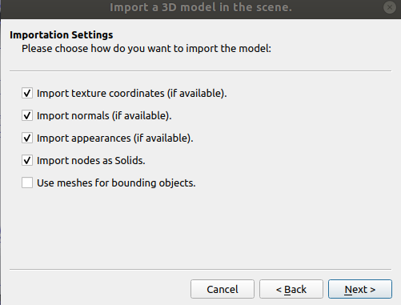
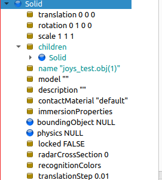
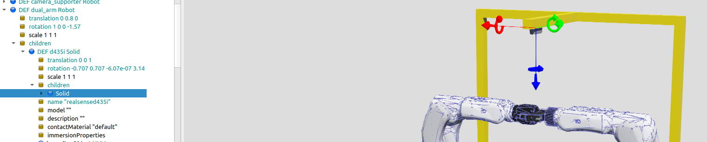
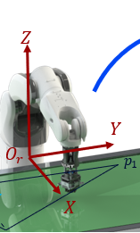

# FYP_ws

This is nachi robot's webots simulation package for FYP.

 ## Introduction
 
This package hosts the configuration files, models, and programs for simulating and use the nachi robot. We provide:

- Webots proto files in [nachi_webots](nachi_webots)
- ROS control API in [nachi_ros](nachi_ros)

## Dependencies

1. Install the latest version of [Webots](https://cyberbotics.com/)

2. Install ROS dependencies:

   ```shell script
   sudo apt-get install ros-$ROS_DISTRO-webots-ros
   ```
3. Install RoTools-v2 dependencies:
- please follow readme in RoTools-v2 package.

## Install

1. Download the source code from .
2. Download the nachi_webots from the [link](https://pan.baidu.com/s/1dnXgXcDh4rI3FDsxc8uu2w), password: s67k
3. Add the line `export DUAL_ARM_HOME=/home/$USER/nachi_dual_arm` into your `.bashrc` or `.zshrc` file. 
   This assumes that you have put this repository to your home folder. You can change the path accordingly.
   
## Usage
Firstly, create and build a catkin workspace:
```shell script
$ mkdir -p ~/FYP_ws/src
$ cd ~/FYP_ws/
# put codes in this folder then build
$ catkin_make
```
then  source your workspace, add the following code to your .bashrc file:
```shell script
source ~/FYP_ws/devel/setup.bash
```
## 从这里开始：

搭建自己的webots虚拟环境。另存dual_arm_demo_v1.wbt文件进行自己虚拟环境的搭建，然后命名保存，如dual_arm_demo_(your name).wbt
保存的文件会在/home/hp/nachi_dual_arm/nachi_webots/worlds文件夹下。

- 导入自己的工件

从solidworks中导出的stl文件，单位必须为**m**。
再导入webots中，保持默认选项，

然后webots scene tree中会出现导入的物体，



将children中的solid复制出来，paste到scene tree的最后，将原有的solid删除，这样可以避免定义两次bounding object 和physics。

- 定义bounding object和physics


可以点击 view/optional rendering/show all bounding box, 查看 bounding box与物体模型的重合程度，近似就行，不用那么精确。
- 拍照位置

为了能够得到合适的物体图片，需要确定工件和相机的位置。
相机的位置可以图中所示的translation和rotation改变。

设置好之后机器人就能抓取物体了。



### 1. Start the Webots simulation

如果想启动自己的虚拟环境，需要修改dual_arm_webots,launch文件，

```shell script
<arg name="world" default="dual_arm_demo_v1"/> 更改为你的.wbt文件名称
```
然后重新运行以下命令。
You can start a simulation scenario for the nachi robot with the command:

```shell script
roslaunch dual_arm_bringup dual_arm_webots.launch
```
This command takes a `world` argument, by default, it will be `default`.

**then press start button in webots. 点击开始按钮。** 
如果不开始运行仿真的话，后面三个终端的程序无法启动。


### 2. Start MoveIt! package
```shell script
roslaunch dual_arm_bringup dual_arm_moveit.launch

当界面出现 you can start planning now! 说明启动成功!

否则说明webots开始按钮没有按下.
```
### 3. Start roport functional package
```shell script
roslaunch dual_arm_bringup dual_arm_roport.launch

当界面出现 Roport: MoveIt sever ready! 说明启动成功!
```
### 4. Start python control demo program
```shell script
# you can create a virtual environment to run this command
# move to dual_arm_bringup/scripts folder
python dual_arm_grasp_test.py
```
## 注意：

四条运行命令依次在四个终端中运行，如果前三个终端中出现错误，请重启所有前三个终端中。

在dual_arm_grasp_test.py的simple_test的函数中：

### 1.
```shell script
pose0 = Transform.from_list([0.35, 0.1, 0.05, 1, 0, 0, 0])
该函数共有七个参数, 分别为在机器人基坐标系下的位置(x,y,z)和姿态(qx,qy,qz,qw)
```
具体请参考:



### 2
```shell script
trajectory1 = [pose1, pose2] # trajectory1 包含pose1, pose2两个位置点
self.execute_trajectory(group_name, trajectory1) #让机器人执行trajectory1运动
```