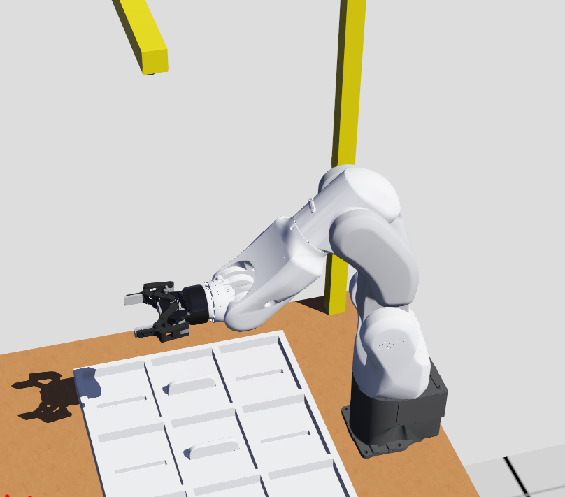
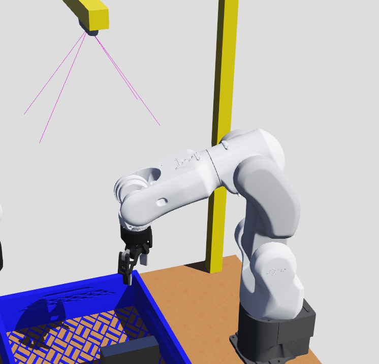
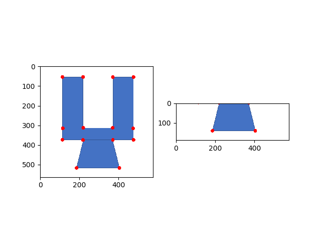

# FYP_ws

This is nachi robot's webots simulation package for FYP.

 ## Introduction
 
This package hosts the configuration files, models, and programs for simulating and use the nachi robot. We provide:

- Webots proto files in [nachi_webots](nachi_webots)
- ROS control API in [nachi_ros](nachi_ros)

## Dependencies

1. Install the latest version of [Webots](https://cyberbotics.com/)

2. Install ROS dependencies:

   ```shell script
   sudo apt-get install ros-$ROS_DISTRO-webots-ros
   ```
3. Install RoTools-v2 dependencies:
- please follow readme in RoTools-v2 package.

## Install

1. Download the source code from .
2. Download the nachi_webots from the [link](https://pan.baidu.com/s/1dnXgXcDh4rI3FDsxc8uu2w), password: s67k
3. Add the line `export DUAL_ARM_HOME=/home/$USER/nachi_dual_arm` into your `.bashrc` or `.zshrc` file. 
   This assumes that you have put this repository to your home folder. You can change the path accordingly.
   
## Usage
Firstly, create and build a catkin workspace:
```shell script
$ mkdir -p ~/FYP_ws/src
$ cd ~/FYP_ws/
# put codes in this folder then build
$ catkin_make
```
then  source your workspace, add the following code to your .bashrc file:
```shell script
source ~/FYP_ws/devel/setup.bash
```
## 从这里开始：

搭建自己的webots虚拟环境。另存dual_arm_demo_v1.wbt文件进行自己虚拟环境的搭建，然后命名保存，如dual_arm_demo_(your name).wbt
保存的文件会在/home/hp/nachi_dual_arm/nachi_webots/worlds文件夹下。

webots的使用请参考：
[webots Tutorial 1, 2, 3](https://cyberbotics.com/doc/guide/tutorial-1-your-first-simulation-in-webots)

**注意：** 当修改world文件时，必须确保仿真是暂停的，并且虚拟时间为0（the simulation is paused and is at a virtual time of 0.） 
，如果不为0，需要点击reset simulation按钮，然后修改。

当想要保存修改的world时，可以点击File / Save World， 
- 导入自己的工件

从solidworks中导出的stl文件，单位必须为**m**。
再导入webots中，保持默认选项，

然后webots scene tree中会出现导入的物体，


将children中的solid复制出来，paste到scene tree的最后，将原有的solid删除，这样可以避免定义两次bounding object 和physics。

- 定义bounding object和physics


可以点击 view/optional rendering/show all bounding box, 查看 bounding box与物体模型的重合程度，近似就行，不用那么精确。
- 拍照位置

为了能够得到合适的物体图片，需要确定工件和相机的位置。
相机的位置可以图中所示的translation和rotation改变。


设置好之后机器人就能抓取物体了。


### 1. Start the Webots simulation

如果想启动自己的虚拟环境，需要修改dual_arm_webots,launch文件，

```shell script
<arg name="world" default="dual_arm_demo_v1"/> 更改为你的.wbt文件名称
```
然后重新运行以下命令。
You can start a simulation scenario for the nachi robot with the command:

```shell script
roslaunch dual_arm_bringup dual_arm_webots.launch
```
This command takes a `world` argument, by default, it will be `default`.

**then press start button in webots. 点击开始按钮。** 
如果不开始运行仿真的话，后面三个终端的程序无法启动。


### 2. Start MoveIt! package
```shell script
roslaunch dual_arm_bringup dual_arm_moveit.launch

当界面出现 you can start planning now! 说明启动成功!

否则说明webots开始按钮没有按下。
```
### 3. Start roport functional package
```shell script
roslaunch dual_arm_bringup dual_arm_roport.launch

当界面出现 Roport: MoveIt sever ready! 说明启动成功!
```
### 4. Start python control demo program
```shell script
# you can create a virtual environment to run this command
# 现在可以直接使用已经建好的虚拟环境， 输入：
dp2.7
# move to dual_arm_bringup/scripts folder
roscd dual_arm_bringup/scripts
# 启动python脚本
python dual_arm_grasp_test.py
```

## 注意：
- 可以在webots中取消阴影投影。
- 当仿真器console报错，crash之后，需要reset simulation,重新启动terminate2, 3命令。
- 有时机器人无法到达命令的位置点，这是由于机器人规划失败导致的。可以增加一些中间路径点，或者换其他更容易到达的位置点。
- 四条运行命令必须依次在四个终端中运行，只有上一个命令运行成功之后，才能运行下一个命令。如果前三个终端中出现错误，请重启所有前三个终端中。

在dual_arm_grasp_test.py的simple_test的函数中：

### 1. 示例代码
``` python
#基本流程：定义预抓取点，抓取点，向上回退点（可以和预抓取点相同），移动路径中间点，物体放置点。
def simple_test(self):
   #增加初始位置点，改变机器人的水平状态，让机器人的动作更好规划，否则机器人可能规划失败，无法移动。
   pose_init = Transform.from_list([0.33, 0, 0.25, 0, 1, 0., 0.]) #初始位置点
   self.execute_trajectory(group_name, [pose_init]) #机器人执行轨迹的命令
   #定义两个位置点pose0, pose1 (末端工具中心TCP的位置）
   pose0 = Transform.from_list([0.33, -0.05, 0.25, 0, 1, 0., 0.]) #预抓取点
   pose1 = Transform.from_list([0.33, -0.05, 0.2, 0, 1,  0, 0]) #抓取点
   #Transform.from_list该函数共有七个参数, 分别为在机器人基坐标系下的位置(x,y,z)和姿态(qx,qy,qz,qw)
   # (x,y,z)坐标范围, 单位：m：
   #x:[0.1, 0.4]
   #y:[-0.2, 0.2]
   #z:[-0.1, 0.4]
   #需要在机器人的工作范围内设置合理的位置点，否则机器人无法执行。
   
   group_name = 'right_arm'
   trajectory1 = [pose0, pose1] # 机器人的运动轨迹包含两个位置点pose0, pose1
   self.execute_trajectory(group_name, trajectory1) #机器人执行轨迹的命令
   self.control_gripper('close') # 闭合gripper，抓取
   
   pose3 = Transform.from_list([0.33, -0.05, 0.2, 0, 1,  0., 0.]) # 示例移动路径中间点
   # gripper 从竖直向下的姿态，绕竖直线旋转45度
   pose_test = Transform.from_list([0.5, -0.05, 0.4, 0, 1, 0, 0]) #物体放置点
   pose_test.translation = [0.33, -0.05, 0.3] # pose_test的平移
   pose_test.rotation = Rotation.from_euler('YZX', [180, 45, 0], degrees=True) # pose_test的旋转
   trajectory = [pose3, pose_test]
   self.execute_trajectory(group_name, trajectory)
   self.control_gripper('open') # 开启gripper，放置物体
   ### 图像获取
   img_resp = self.get_img_data()
   imgs = img_resp.images
   img_np = ros_numpy.numpify(imgs[0])[:, :, ::-1] # RGB图像
   depth_np = ros_numpy.numpify(imgs[1]) # 深度图像
   #print(img_np.shape, depth_np.shape)
   
   #图像展示
   plt.subplot(1, 2, 1)
   plt.imshow(img_np)
   plt.subplot(1, 2, 2)
   plt.imshow(depth_np)
   plt.show()
   
   # your function 比如:
   flag = is_object_qualified(img_np) # 传入图像，判断是否合格
   
   #如果合格，则放置在一个位置；如果不合格，则放置在另外的位置。
   if flag:
      # 
   else:
      #


def is_object_qualified(self, img):
   import cv2 as cv
   gray = cv.cvtColor(img, cv.COLOR_BGR2GRAY)
   corners = cv.goodFeaturesToTrack(gray, 25, 0.01, 10)
   corners = np.int0(corners)
   corners = np.squeeze(corners)
   # 按照x坐标排序
   sort_corners = corners[np.argsort(corners[:, 0])]
   # print(sort_corners.shape, sort_corners)
   for i in sort_corners:
       x, y = i.ravel()
       cv.circle(img, (x, y), 9, (0, 0, 255), -1)
   plt.imshow(img[:, :, ::-1])
   plt.savefig('./doc/demo.png')
   plt.show()
   
   ***** your code ********
   return flag
   
   

```
修改程序后，ctrl+s保存程序，然后重新运行'python dual_arm_grasp_test.py'

坐标系请参考:

- pose1
``` python
pose_test = Transform.from_list([0.33, -0.05, 0.2, 0, 1,  0., 0.])
pose_test.translation = [0.33, -0.05, 0.3]
手抓方向为水平，如要旋转gripper的角度，可以变化var [90, var, 0]
pose_test.rotation = Rotation.from_euler('YZX', [90, 0, 0], degrees=True)
```

- pose2
``` python
pose_test = Transform.from_list([0.5, -0.05, 0.4, 0, 1, 0, 0])
# gripper 从竖直向下的姿态，绕竖直线旋转45度, 如要旋转gripper的角度，可以变化var [180, var, 0]
pose_test.rotation = Rotation.from_euler('YZX', [180, 45, 0], degrees=True)
```

- gripper转动
``` python
# gripper 在当前姿态下绕gripper的对称轴旋转var度
pose_test.rotation = Rotation.from_euler('YZX', [variable, var, 0], degrees=True)
```
``` python

```

### 2
关于使用角点检测，来计算判断距离，请参考src/detect_test1.py
``` python
import numpy as np
import cv2 as cv
from matplotlib import pyplot as plt

filename = './doc/image4.png'
img = cv.imread(filename)
gray = cv.cvtColor(img, cv.COLOR_BGR2GRAY)
corners = cv.goodFeaturesToTrack(gray, 25, 0.01, 10)
corners = np.int0(corners)
corners = np.squeeze(corners)
# 按照x坐标排序
sort_corners = corners[np.argsort(corners[:, 0])]
# print(sort_corners.shape, sort_corners)
for i in sort_corners:
    x, y = i.ravel()
    cv.circle(img, (x, y), 9, (0, 0, 255), -1)
plt.imshow(img[:, :, ::-1])
plt.savefig('./doc/demo.png')
plt.show()

print(f'第一条边和第四条边之间的距离为{sort_corners[0, 1]- sort_corners[-1, 1]} pixel')

```
最终效果如下：
